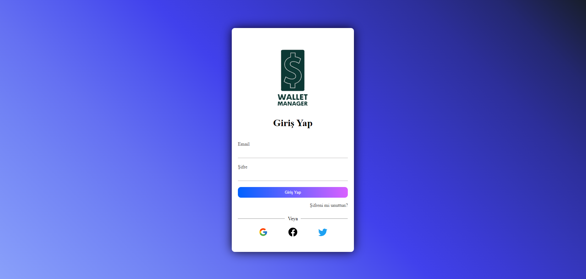
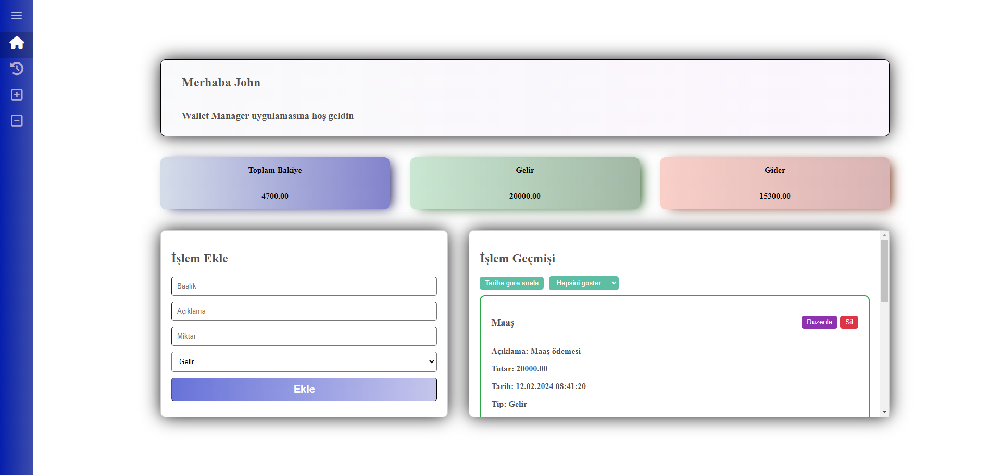
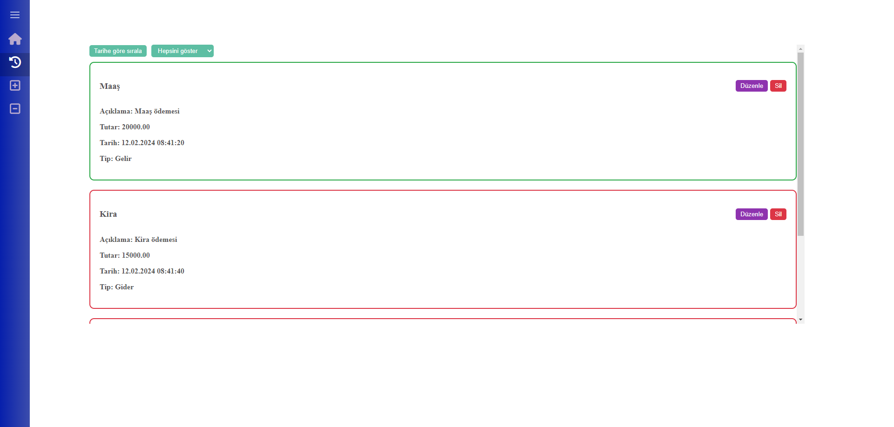
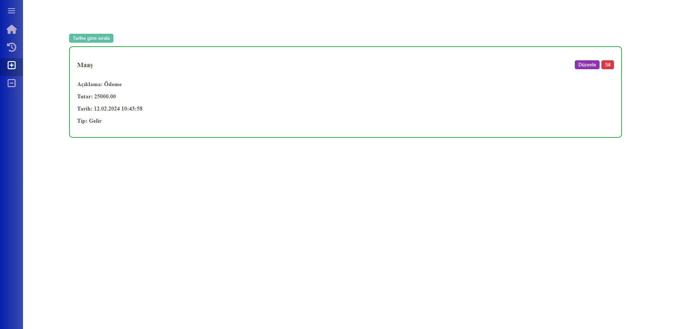
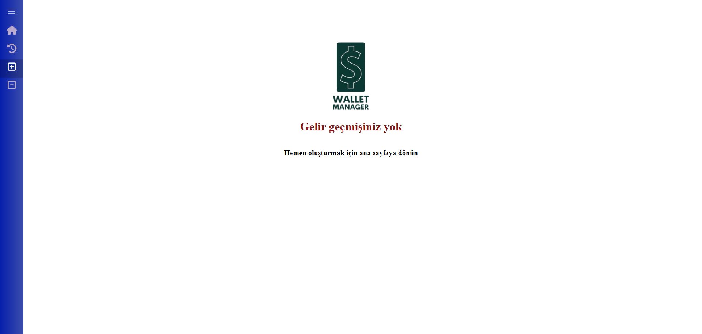

# Wallet Manager

## Genel Bakış

**Wallet Manager** kullanıcıların gelir ve giderlerini kaydedebilecekleri, düzenleyebilecekleri ve silebilecekleri bir kişisel gider takip uygulamasıdır.

## Uyarı

_Herhangi bir veritabanı bulunmadığı için form girişleri statik bir şekilde sağlanmıştır._ Login ekranında giriş yapabilmek için gerekli bilgiler :
email : **johndoe@gmail.com**
şifre : **john123**

## Ön İzleme

    
    
    
    
    
    

## Özellikler

- :white_check_mark: **Ana Sayfa:** Kullanıcı bu sayfada toplam gelir, toplam gider ve net bakiyeyi görebilir.

- :white_check_mark: **Gelir/Gider Ekleme:** Kullanıcılar, gelir veya gider ekleyebilir. Her işlem için; miktar, açıklama ve tarih bilgileri kaydedilir.

- :white_check_mark: **Gelir/Gider Listeleme:** Eklenen gelir ve giderler, ayrı listeler halinde kullanıcıya sunulur.

- :white_check_mark: **Gelir/Gider Düzenleme/Silme:** Kullanıcılar, mevcut gelir veya gider kayıtlarını düzenleyebilir veya silebilir.

- :white_check_mark: **Navigasyon:** Kullanıcılar, ana sayfa ve gelir/gider listeleme sayfaları arasında
  gezinebilir.

- :white_check_mark: **Form Doğrulama:** Form doğrulama işlemleri Formik kullanılarak gerçekleştirilmiştir. Bu sayede kullanıcılar form alanlarına veri girişi yaparken hata kontrolü sağlanmış ve kullanıcı dostu geri bildirimler sunulmuştur.

## Kullanılan Teknolojiler

- **React:** Kullanıcı arayüzünü modüler bir şekilde oluşturmak için React kullanılmıştır.
- **Redux:** Uygulama genelindeki durum yönetimi ve veri paylaşımı Redux kullanılarak sağlanmıştır.
- **React Router:** Sayfa yönlendirmesi ve yönetimi için React Router kullanılmıştır, bu sayede kullanıcılar farklı bileşenler arasında kolayca gezinebilirler.
- **CSS:** Uygulamanın stilini belirlemek ve görünümünü düzenlemek için CSS kullanılmıştır.
- **Formik:** Form işlemlerinin kolay ve verimli bir şekilde yönetilmesi için Formik kütüphanesi kullanılmıştır.

## Contact

If you have any questions, suggestions, or just want to connect, you can reach me at:

- Email: alkan.atakan@outlook.com
- LinkedIn: [Atakan Alkan](https://www.linkedin.com/in/atakanalkn/)
